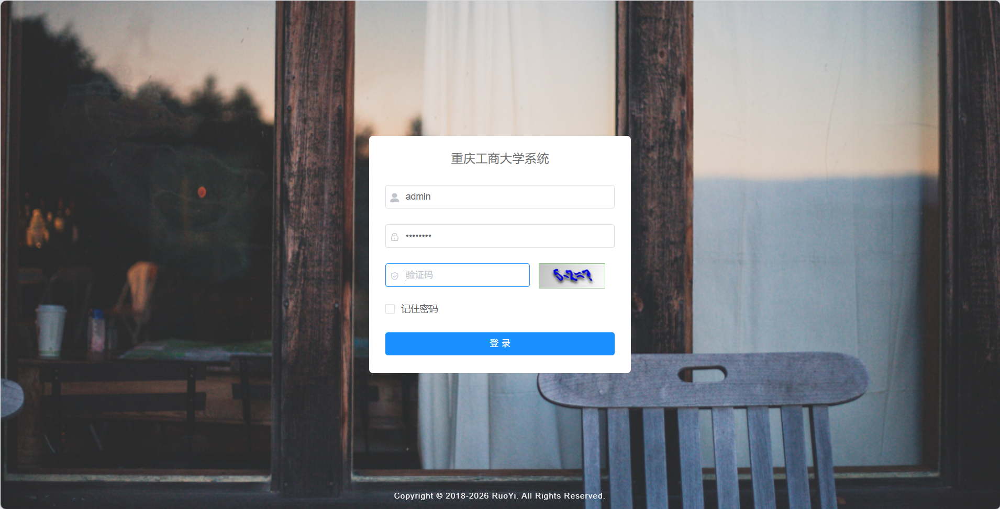
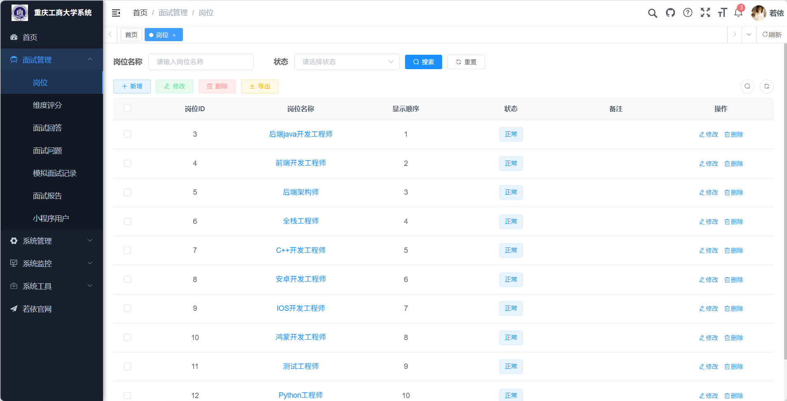
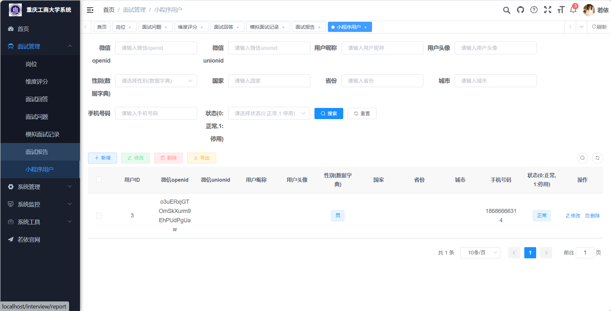
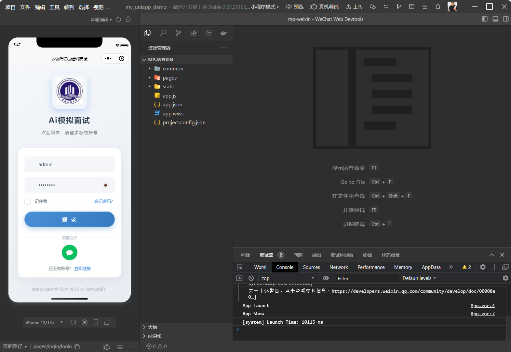
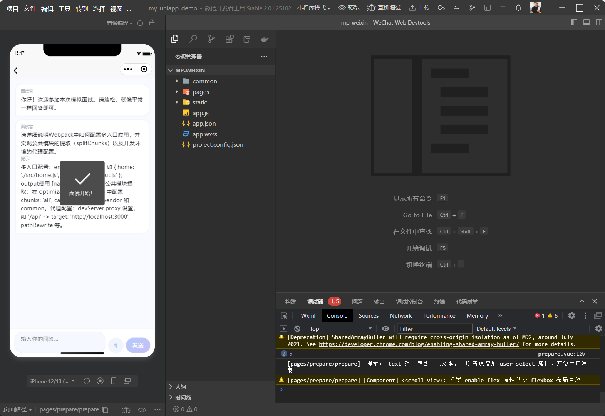

<h1 align="center">AI面试实战训练系统</h1>
<h4 align="center">基于若依(RuoYi)框架二次开发的智能面试训练平台</h4>

## 平台简介

本项目基于若依(RuoYi)后台管理系统进行二次开发，在原有人事管理、权限控制等功能基础上，扩展了 **AI面试实战训练** 模块，为高校学生提供智能化的面试模拟与评估服务。

* 前端：Vue 2 + Element UI
* 后端：Spring Boot 2 + Spring Security + Redis + JWT
* 数据库：MySQL
* 面试模块：AI 生成面试题目、多维度评分、面试报告生成、微信小程序接口集成

## 内置功能

1.  用户管理：用户是系统操作者，该功能主要完成系统用户配置。
2.  部门管理：配置系统组织机构（公司、部门、小组），树结构展现支持数据权限。
3.  岗位管理：配置系统用户所属担任职务。
4.  菜单管理：配置系统菜单，操作权限，按钮权限标识等。
5.  角色管理：角色菜单权限分配、设置角色按机构进行数据范围权限划分。
6.  字典管理：对系统中经常使用的一些较为固定的数据进行维护。
7.  参数管理：对系统动态配置常用参数。
8.  通知公告：系统通知公告信息发布维护。
9.  操作日志：系统正常操作日志记录和查询；系统异常信息日志记录和查询。
10. 登录日志：系统登录日志记录查询包含登录异常。
11. 在线用户：当前系统中活跃用户状态监控。
12. 定时任务：在线（添加、修改、删除)任务调度包含执行结果日志。
13. 代码生成：前后端代码的生成（java、html、xml、sql）支持CRUD下载 。
14. 系统接口：根据业务代码自动生成相关的api接口文档。
15. 服务监控：监视当前系统CPU、内存、磁盘、堆栈等相关信息。
16. 缓存监控：对系统的缓存信息查询，命令统计等。
17. 在线构建器：拖动表单元素生成相应的HTML代码。
18. 连接池监视：监视当前系统数据库连接池状态，可进行分析SQL找出系统性能瓶颈。

## 面试模块（二次开发新增）
1. **岗位管理**：管理面试岗位类型（Java开发、前端开发、测试等），每个岗位关联专属题库。
2. **维度评分**：从沟通表达、技术能力、项目经验等多个维度对面试回答进行量化评分。
3. **AI 智能出题**：根据岗位自动生成针对性的面试题目。
4. **答题记录**：记录每次面试的问答过程，支持历史回顾。
5. **面试报告**：综合评估面试表现，生成可视化的评估报告与改进建议。
6. **微信小程序端**：提供微信小程序登录与面试入口，支持移动端答题（可选）。

## 项目结构

- **ruoyi-admin/** — 若依后台管理入口
- **ruoyi-common/** — 通用工具类
- **ruoyi-framework/** — 若依框架核心
- **ruoyi-system/** — 系统管理模块
- **ruoyi-generator/** — 代码生成器
- **ruoyi-quartz/** — 定时任务
- **ruoyi-ui/** — Vue 前端（含面试模块前端页面）
- **interview/** — AI面试训练模块（Java后端）
- **miniapp/** — AI面试小程序端（uni-app，微信小程序）
- **sql/** — 数据库脚本
- **doc/** — 项目文档

## 快速开始

1. 导入 `sql/` 目录下的数据库脚本到 MySQL
2. 修改 `ruoyi-admin/src/main/resources/application-druid.yml` 中的数据库连接信息
3. 修改 `ruoyi-admin/src/main/resources/application.yml` 中的 Redis 连接信息
4. 启动后端：运行 `ruoyi-admin/src/main/java/com/ruoyi/RuoYiApplication.java`
5. 启动前端：
   cd ruoyi-ui
   npm install
   npm run dev

6. 访问 http://localhost:8080 ，默认账号 admin / admin123

## 演示截图

| 后台登录 | 系统仪表盘 |
  |----------|-----------|
|  |  |

| 面试管理 | 小程序登录 | 小程序面试 |
  |----------|-----------|-----------|
|  |  |  |

## 致谢

本项目基于 [RuoYi-Vue](https://gitee.com/y_project/RuoYi-Vue) 进行二次开发，感谢若依团队的开源贡献。

